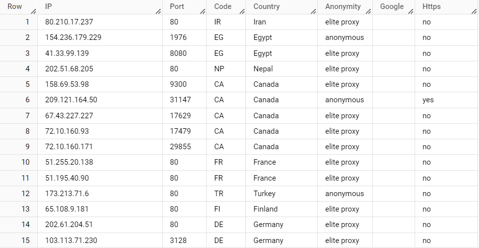

# Парсинг прокси и загрузка данных в BigQuery

Этот код реализует процесс парсинга прокси с веб-сайта https://free-proxy-list.net/ и загрузки полученных данных в таблицу BigQuery в Google Cloud. Он использует Apache Airflow для планирования и выполнения задач в виде Directed Acyclic Graph (DAG).

## Установка и настройка

Убедитесь, что у вас есть учетные данные для аутентификации в Google Cloud, которые должны быть сохранены в файле `google_authorization.py` в виде функции `google_json`, которая возращает словарь.

# Описание кода

```py
from airflow.models import DAG
from airflow.operators.python import PythonOperator
from airflow.utils.dates import days_ago
from bs4 import BeautifulSoup
import requests
import pandas as pd
from google.cloud import bigquery
from google.oauth2 import service_account
from google_authorization import google_json
import ping3
import time
```

Код начинается с импорта необходимых модулей и библиотек.

```py
args = {
    'owner': 'Vnaumq',
    'start_date': days_ago(1)
}
```

Задаются аргументы для DAG (Directed Acyclic Graph), включая владельца и дату начала выполнения.

```py
credentials_info = google_json()
credentials = service_account.Credentials.from_service_account_info(credentials_info)
```

Получаются учетные данные для аутентификации в Google Cloud из файла google_authorization.py и создается объект `credentials`, используемый для аутентификации при работе с BigQuery.

```py
def export_table():
    '''
    функция для парсинга proxy из сайта  https://free-proxy-list.net/ и проверка на то есть ли этот пинг уже в BQ
    '''
    # Установка идентификатора проекта
    project_id = 'testvizuators'
    # Создание клиента BigQuery с указанными учетными данными и идентификатором проекта
    client = bigquery.Client(credentials= credentials,project=project_id)
    # Запрос к таблице в BigQuery для получения списка IP-адресов
    query_job = client.query("""
            SELECT IP 
            FROM testvizuators.ip_dataset.ip_table    
                            """)
    # Получение результатов запроса
    results = query_job.result()
    # Создание списка IP-адресов в BigQuery
    ip_gbq = []
    for i in results:
        for j in i:
            ip_gbq.append(j)
    len(ip_gbq)
    # URL-адрес для парсинга
    url = 'https://free-proxy-list.net/'
    # Запрос страницы
    page = requests.get(url)
    # Создание объекта BeautifulSoup для парсинга HTML
    soup = BeautifulSoup(page.text, "html.parser")
    # Поиск таблицы с прокси
    proxy = soup.find('table', class_ = 'table table-striped table-bordered')
    # Получение заголовков столбцов
    headers = []
    for i in proxy.find_all('th'):
        title = i.text
        headers.append(title)
    headers
    # Создание пустого DataFrame с указанными заголовками столбцов
    df = pd.DataFrame(columns=headers)
    # Парсинг строк таблицы
    rows = proxy.find_all('tr'[0:])
    for row in rows:
        # Парсинг данных внутри строки
        data = row.find_all('td')
        row = [i.text for i in data]
        # Проверка на соответствие количества данных и заголовков столбцов и отсутствие IP-адреса в BigQuery
        if len(row) == len(headers) and row[0] not in ip_gbq: 
            # Добавление строки в DataFrame
            df.loc[ len(df.index )] = row
    # Преобразование DataFrame в JSON-строку
    df = df.to_json()
    return df
```

В этом коде происходит парсинг сайта и проверка на уникальносит ip

```py
def transform_table(**context):
    # Получение JSON-данных из контекста выполнения предыдущего задания 'export'
    json_data = context['ti'].xcom_pull(task_ids='export')
    # Преобразование JSON-данных в DataFrame
    df = pd.read_json(json_data)

    # Итерация по случайным IP-адресам из столбца 'IP Address' в DataFrame
    for ip in df['IP Address'].sample(n=df.shape[0]):
        # Выполнение пинга на IP-адрес с таймаутом 4 секунды
        result =  ping3.ping(ip, timeout=4)
        print(result)
        # Проверка результата пинга
        if result is not None:
            print(f"{ip} - ping successful.")
            # Оставляем только строки с успешным пингом
            df = df.loc[df['IP Address'] == ip]
            break
        elif df.shape[0] == 0:
            print('no successful IPs')
            break
        else:
            print(f"{ip} - ping failed.")
            # Удаляем строки с неуспешным пингом
            df.drop(df.loc[df['IP Address'] == ip].index, axis=0, inplace=True)
    
    # Удаление столбца 'Last Checked'
    df.drop(['Last Checked'], axis=1, inplace=True)
    # Переименование столбца 'IP Address' в 'IP'
    df.rename(columns={'IP Address' : 'IP'}, inplace=True)
    # Преобразование DataFrame в JSON-строку
    df = df.to_json()
    return df
```

В этом коде выполняется проверка айпи на валидность

```py

def load_table(**context):
    # Получение JSON-данных из контекста выполнения предыдущего задания 'transform'
    json_data = context['ti'].xcom_pull(task_ids='transform')
    # Преобразование JSON-данных в DataFrame
    df = pd.read_json(json_data)
    # Преобразование столбца 'Port' в строковый тип данных
    df['Port'] = df['Port'].astype(str)
    
    # Установка идентификатора проекта
    project_id = 'testvizuators'
    # Создание клиента BigQuery с указанными учетными данными и идентификатором проекта
    client = bigquery.Client(credentials=credentials, project=project_id)
    # Конфигурация задания загрузки
    job_config = bigquery.LoadJobConfig(
        autodetect=True,
        write_disposition='WRITE_APPEND'
    )
    # Идентификатор целевой таблицы в BigQuery
    target_table_id = 'testvizuators.ip_dataset.ip_table'
    # Загрузка DataFrame в таблицу BigQuery
    job = client.load_table_from_dataframe(df, target_table_id, job_config=job_config)
    
    # Ожидание завершения выполнения задания загрузки
    while job.state != 'DONE':
        time.sleep(2)
        job.reload()
    
    # Вывод результата задания и количества загруженных строк
    print(job.result())
    print(f'Loaded {df.shape[0]} rows to "{target_table_id}"')
```

Тут происходит сама загрузка данных в BQ

```py
with DAG(
    dag_id='proxy_ETL',
    default_args=args,
    schedule_interval='@daily',
    tags=["proxy_ETL"],
    catchup=False
) as dag:
    # Задача 'export' для экспорта данных
    export = PythonOperator(
        task_id='export',
        python_callable=export_table
    )

    # Задача 'transform' для преобразования данных
    transform = PythonOperator(
        task_id='transform',
        python_callable=transform_table
    )

    # Задача 'load' для загрузки данных
    load = PythonOperator(
        task_id='load',
        python_callable=load_table
    )        

    # Определение зависимостей между задачами
    export >> transform >> load
```

В этом коде сам DAG


Вот так выглядит сам DAG в Apache Airflow




Таблицы в BigQuery в которую грузятся данные